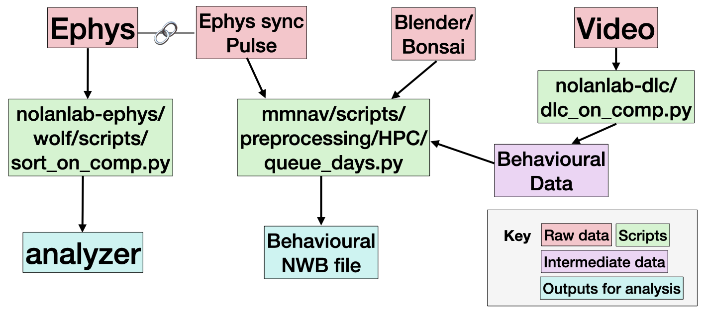

This is a README describing the major analysis pipelines used in the [Nolan Lab](https://nolansurmelilab.github.io/) at the University of Edinburgh.

The main pipelines are designed to do "primary" data analysis, defined as transforming _raw_ data into _derived_ data, used for further scientific data analysis. For example, these pipelines turn raw electrophysiological data into spike trains, and videos into behavioural time series. The derived data is then in a simple format which should make analysis by individual researchers easy. We provide some examples of further analysis, but expect most of this will be written by individuals for their specific research.

Here is an example of a pipeline:

 

Raw data (red), is transformed in derived data (teal) by scripts (green). We try to stick to some simple rules to keep things easy: one script should produce one piece of output; each script is accessible by going to github.com/{script_name}; it should be possible to run each script locally on your computer. Each experiment gets to decide how input and output files are named and organised, but we try to follow the [NeuroBluePrint](https://neuroblueprint.neuroinformatics.dev/latest/index.html) format.

The pipelines have been used on experimental data obtained in the Lab. Each experiment is bespoke, and has its own peculiarities. As such, we keep separate documentation for each experiment although there is much overlap between them. The experiments with documentation are (note: you might need to be a member of the NolanLab GitHub organisation to view these):

[Harry Clark, MEC spatial navigation](https://chrishalcrow.github.io/harry_data_readme/)
[Wolf de Wulf, visual navigation](https://chrishalcrow.github.io/wolf_data_readme/)
[ Junji and Teris, FragileX spatial navigation ]: # 
[ Bri Vandrey, LEC/MEC object ]: # 

These pages should contain all the information needed to understand the data obtained by each experiment, and run the pipeline. The pipeline consists of several scripts. The scripts are stored in GitHub repositories (repo). We keep a repo at https://github.com/MattNolanLab/ for each of the major steps in the pipeline. The most important ones are:

Spike sorting and ephys quality control: nolanlab-ephys
Using DeepLabCut: nolanlab-dlc
NWB-conversion: nolanlab-nwb

These are simple "template" repos. For more complex experiments, you can copy ("make a branch") of the repo, and modify it to suit your needs. One the README of each repo linked above, there are links to the repos used by each individual experimenter. This system is designed so that there is a good base to work from (e.g. the MattNolanLab/nolanlab-ephys has a functional spike sorting pipeline in it) but each researcher can easily customize the pipeline if needed.

If this is all a bit overwhelming: don't worry. There is documentation, advice and instructions on each repo. Go have a look!

All analysis pipelines are version controlled using Git and hosted on GitHub. They are mostly written in Python and package management is organised to work well with uv (though you can use venv or conda if desired) and work on the Edinburgh EDDIE supercomputer. Here are some general resources to help with these tools:

- What is Git?
- Making a project on GitHub
- Zen of Python
- Intro to Python
- uv on EDDIE

And we maintain some helper packages:

Helpers for the EDDIE supercomputer: eddie-helper
Loading data easily: loadi

We use many open source packages:

SpikeInterface
DeepLabCut
Pynapple
Pynts
???
